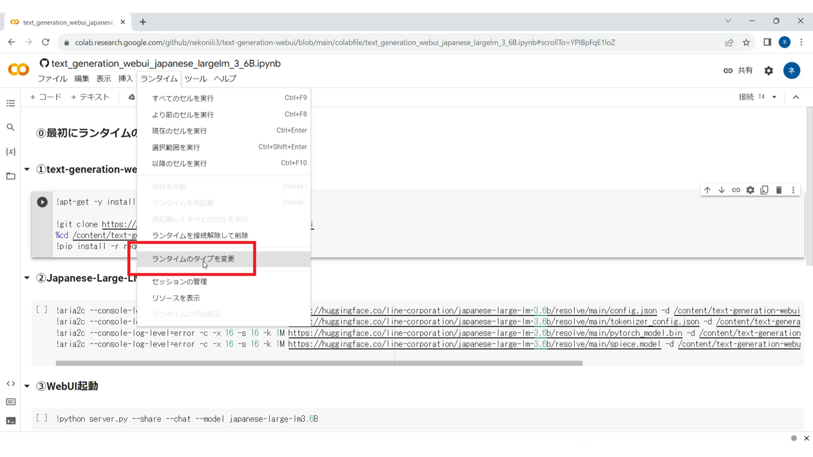
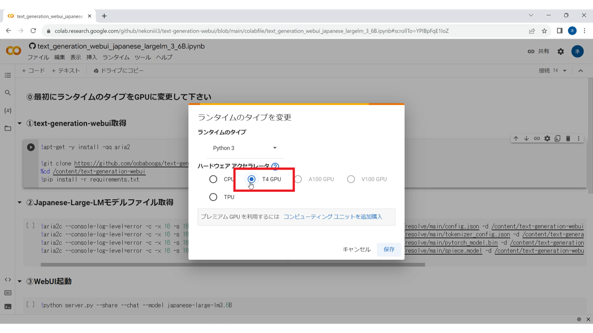
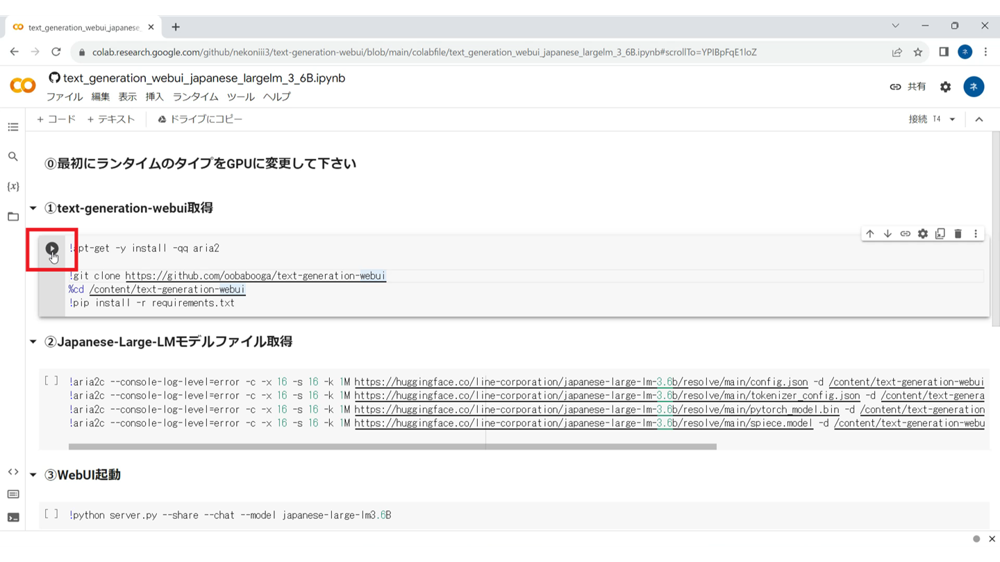
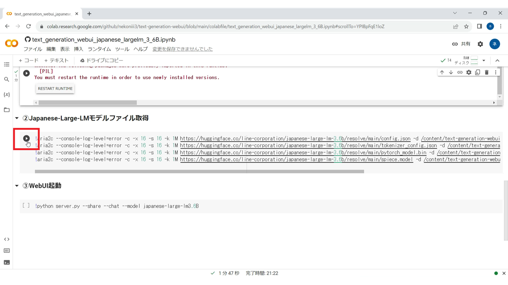
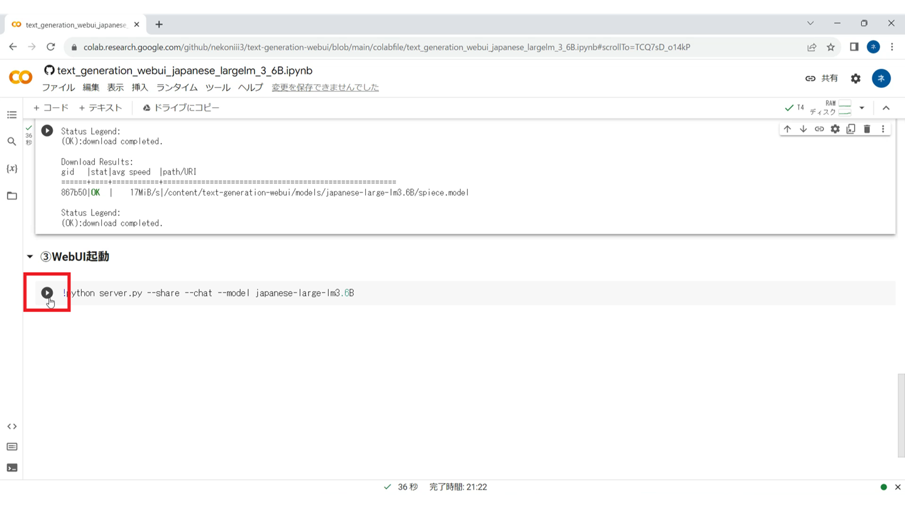
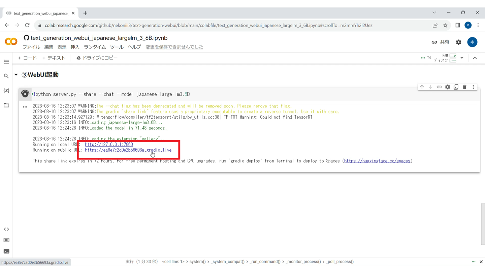
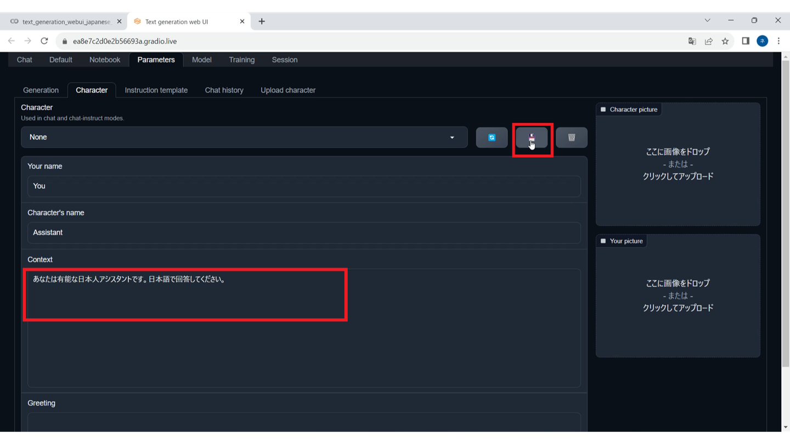

# Text-generation-webUI用Colabノート
 Text-generation-webUIを使うためのGoogleColabノートブックです。 
基のリポジトリはこちら→[Text generation web UI](https://github.com/oobabooga/text-generation-webui)
  

## 利用方法

①～③までの再生マークを順に実行し、表示される"http://～.gradio.live"をクリックして実行して下さい。 
(Stable Diffusion WebUIのような感じです）
  

最初にランタイムをGPUに変更

無料版は[T4 GPU]に 
※JapaneseStableLMは[A100]でしか動作確認できてません。（有料版のみ選択可能）

①の再生マークをクリック（終了まで3分程度かかります）

②の再生マークをクリック（終了まで3分程度かかります）

③の再生マークをクリック

"http://～.gradio.live"をクリック（URLが出てくるまで3分程度かかります）

## 注意
・JapaneseStableLMはGoogleColab有料版で利用できるGPU:A100でのみ動作が確認できています。 
・初期設定でキャラクターがついてある場合があるので適宜設定して下さい。 
（日本語で設定すると、回答も日本語になる可能性が上がります）

## 補足
JapaneseStableLMはそのままだと動作しなかったため、models.pyを修正しています。 
（tokenizerを"novelai/nerdstash-tokenizer-v1"にしています。）

## 利用させて頂いたリポジトリ・モデルファイルなど

・JapaneseStableLMモデルファイル 
https://huggingface.co/stabilityai/japanese-stablelm-base-alpha-7b/tree/main
  
・japanese-large-lmモデルファイル 
https://huggingface.co/line-corporation/japanese-large-lm-3.6b/tree/main